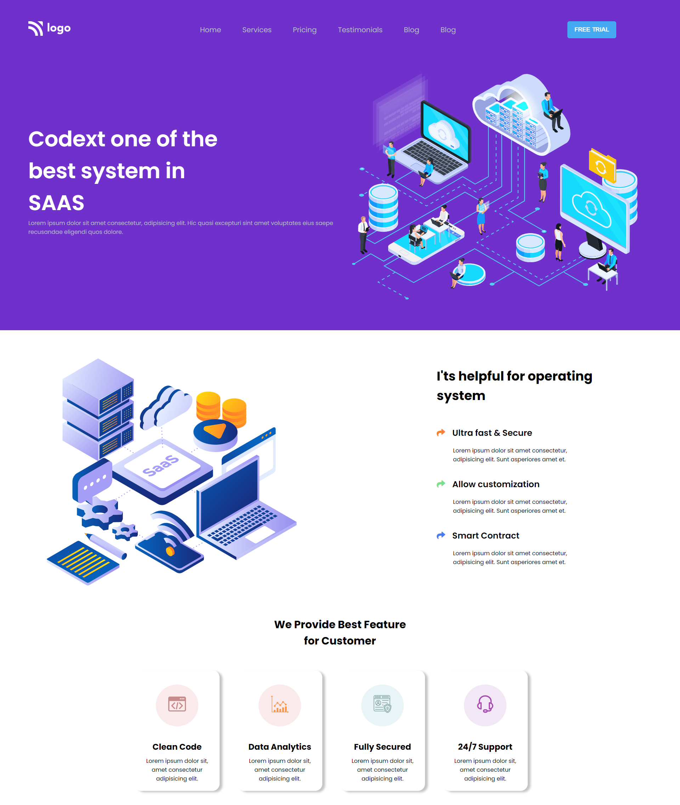

# Project 13: SAAS Landing Page

   

### Name:

> `Anshul Ghogre`

## Key Learnings from the project

- _Explored a way to change SVGs color without using Figma_

---

### Screenshots:-

---

> Time taken to complete this project: 6hrs

---

## [Live-Link](https://project-12-business-landing-page1.netlify.app/)

---
